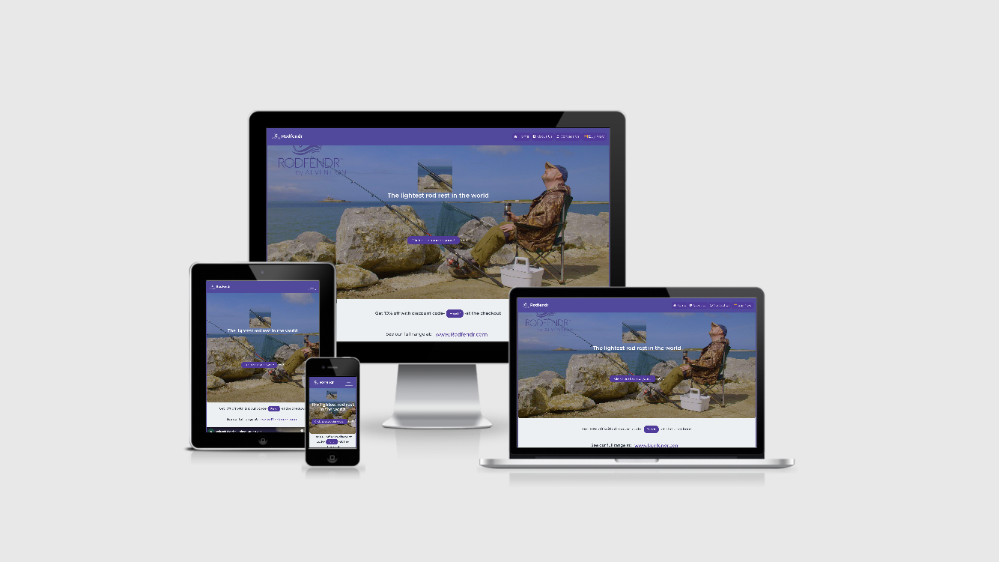

# Rodfendr Promotion Page
## First Milestone Project 2020: User-Centric Frontend Development - Code Institute.
### Demo
Link to demo [here](https://gph.is/g/Z2dYQO5).

### UX
User Expectations
A customer visiting my site will want to get as much information as possible in a short space of time.  The person visiting the site wants to know what is on offer.  They are expecting to see photos and videos of the product, they will also expect a site that loads quickly with fast acting links.  In order to make a purchase customers visiting the site want to know that it’s safe to purchase from it.
### Strategy
My aim was to design a site that immediately captures the visitors attention and encourage them to scroll through the site.  I have placed pictures and videos which explain Rodfendr and I have placed a discount offer for potential customers to take advantage of.  If a picture is worth a thousand words how many is a video worth.  I didn’t want to overload the visitor with long descriptions.
### Scope
The site is designed to promote Rodfendr the lightest fishing rod rest in the world. I want the visitor to understand Rodfendr and for them to think that it is a unique and interesting product that they would buy for themselves or for a friend or loved one. I am also offering them a discount if they decide to purchase through their visit.
### Structure
I immediately want the visitor to see the benefits of using Rodfendr, they can see me relaxing and using Rodfendr to protect my fishing rod.  The video after the heading is about 30 seconds long and quickly explains Rodfendr, there are some photos with small text explaining more about Rodfendr in the About section, followed by some of the features and an introduction to an article written by Off The Scale fishing magazine. These features have accompanying photos and videos.
### Skeleton
1. Landing Page wireframe
2. About wireframe
3. Contact wireframe
4. Privacy wireframe
### Surface
The colors were chosen to contrast easily and make it easy to locate the links especially the “Buy now” link which has an extra orange icon.  The background colors and font colors were chosen to make it easy on the visitors eyes and I used photos and videos instead of a lot of sentences so as not to overload the visitor
### Technologies
1. HTML
2. CSS
3. Bootstrap
4. YouTube
5. Shopify 
6. www.Rodfendr.com is my ecommerce site.
7. Canva
8. Fontawesome
9. Google Fonts
### Features
This site uses Bootstrap, fontawesome, hover, javascript for hamburger menu.I used code I found on  Blacboard to stop my youtube video from continuing to play after it ends 0&rel=0.I used code from Computer Hope to rotate images. All my code has been taken from the previous projects I have taken part in as well as Bootstrap I have modified the code I used and added my own styling to suit the website. I have left uncomments throughout the code where I have used code not my own. I have used google fonts for the main fonts and font awesome for the icons. The links to my main website Rodfendr.com are used to give the user a full ecommerce experience.  All the social media links arrive at Rodfendr pages.
Features Left to Implement
I would like to add a cookie bar to make it a legal site.  I would also like to add some of my other products to give customers a wider choice.
### Testing
This site was tested across multiple browsers (Chrome, Safari, Microsoft Edge, FireFox) and on multiple mobile devices (iPhone 4, 5/SE,6,7,8 iPhone 6,7,8 plus, iPhone X : Chrome and Safari, iPad, iPad Pro,Samsung Galaxy Slll,5S) to ensure compatibility and responsiveness.
I have used the 'required' attribute in the contact form and it is added to the 'name,' 'email,' and 'Please enter your questions or feedback here' fields, so if those fields are not filled in, the form will not submit. If all fields are valid, the page will reload. If a visitor is interested in contacting me, they will have to fill out all fields in order for the form to go through.
All links will open in a new tab using - 'target="_blank"'. All links have been manually tested to ensure that they are pointing to the correct destination. The article by Off the Scale, and the customer opinions are pdf’s and can be downloaded if the visitor wishes to view them later. 
### Deployment
I used Github to host this website.  The site is automatically updated and all changes are logged once a commit has been made to the master branch.  Periodically throughout the development of the site changes and updates have been added using the git commit -m “” command. The landing page is called index.html, which is a required attribute to allow the site to deploy correctly.
### Credits
### Content
All content on the site has been created by me or I have permission to use it.  
### Media
All photos and videos are provided by me from the assets folder except for the large video which I added from my Youtube channel, this video is larger and I didn’t want to slow down the upload speed of the page by loading it from my images folder. I have permission to use the Facebook posts from Emmett, Nick, Rosaleene and the article written by Off the Scale Magazine.
Acknowledgements
The navbars are bootstrap and the button code and image code were adapted from the Whiskey drop and Rosie projects. I used Youtube to import the main video to the landing page.
.
